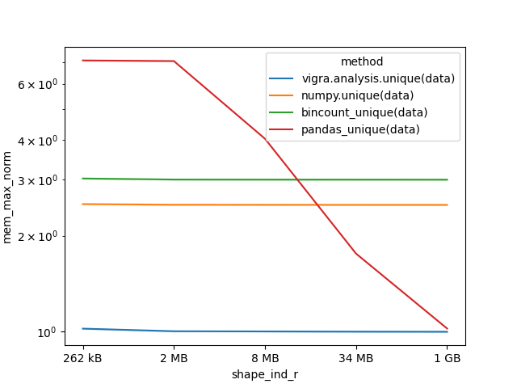
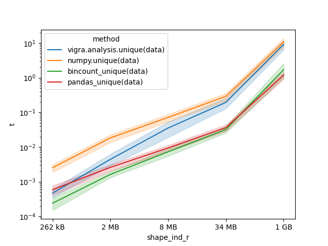
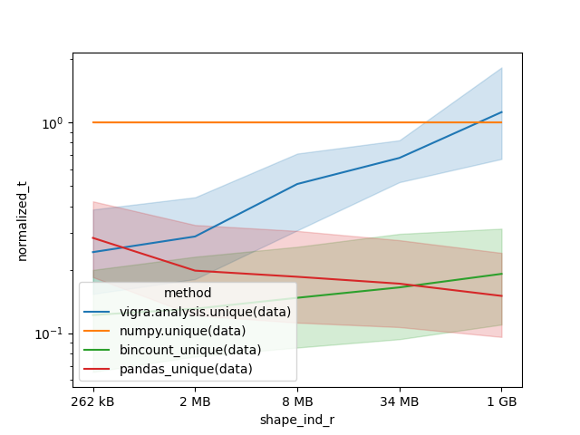
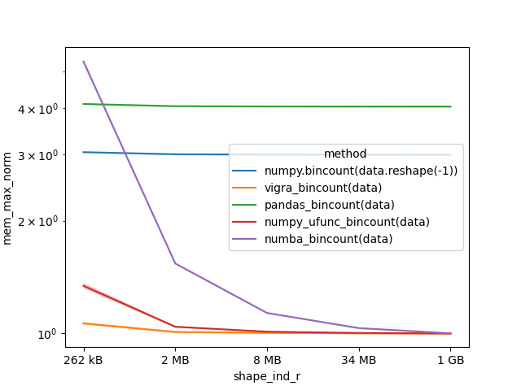
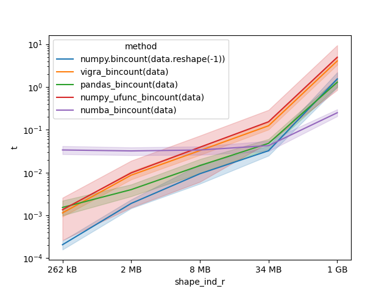
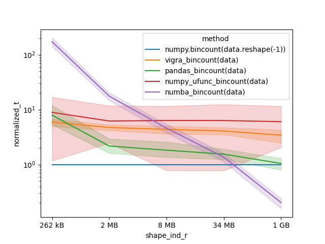

# Results

generated 2024-09-04T13:58:12, from results of 10 machines

## Unique

### Memory usage

### Time

#### Absolute

#### Normalized to `numpy.unique` for each shape/host combination

## Bincount

### Memory usage

### Time

#### Absolute

#### Normalized to `numpy.bincount` for each shape/host combination

